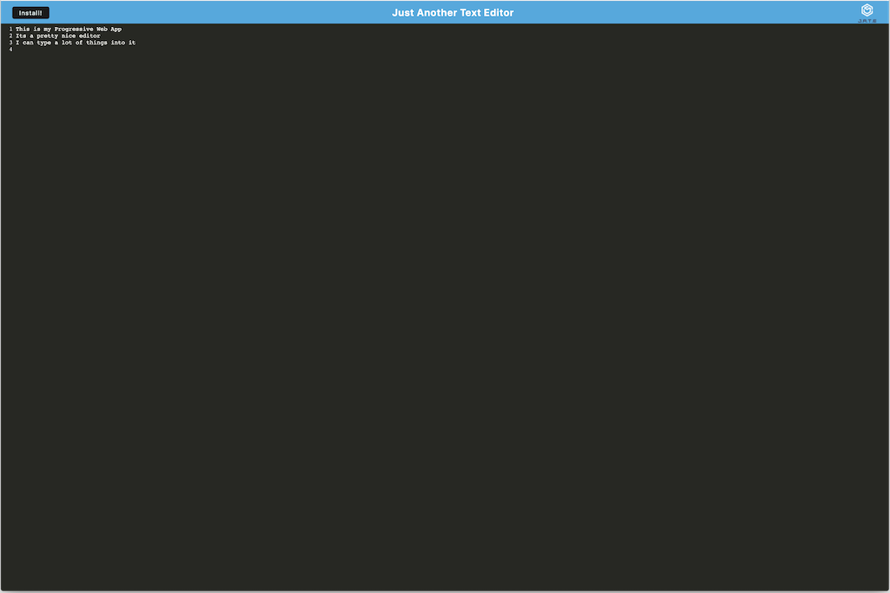
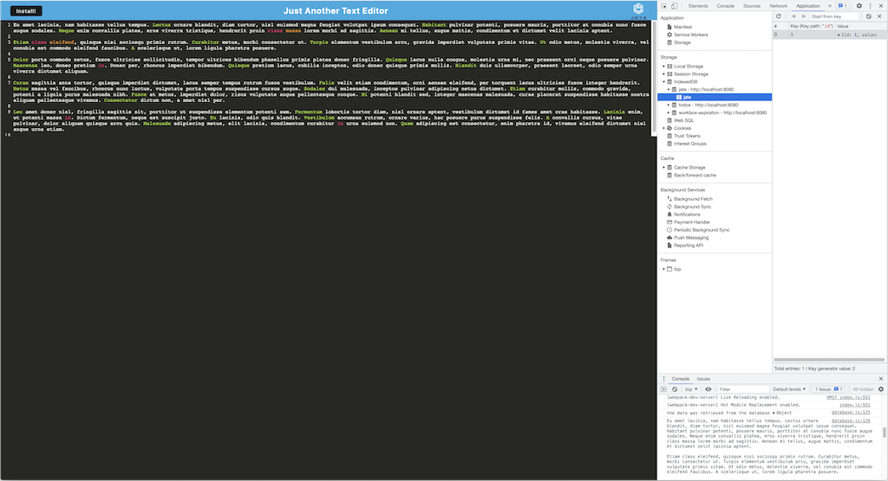
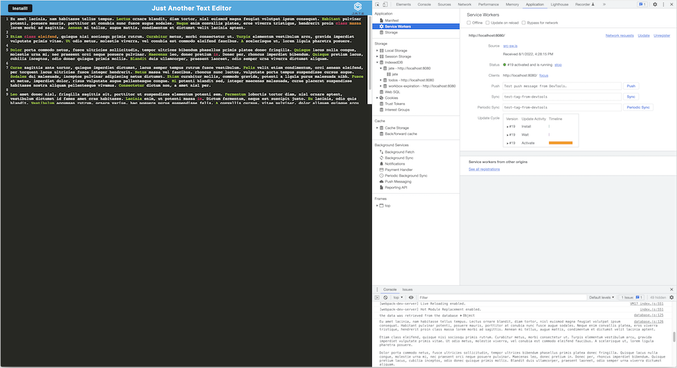
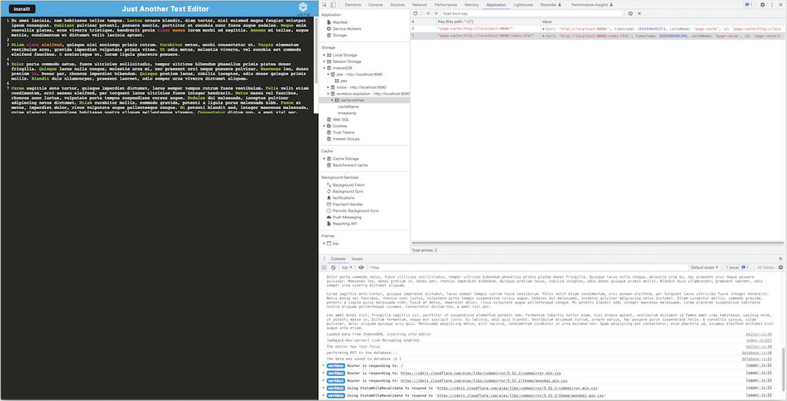

# 19-Text-Editor-PWA

## Table of Contents-
- [PWA Text Editor](#text-editor-pwa)
  - [Table of Contents-](#table-of-contents-)
  - [Licensing](#licensing)
  - [Description](#description)
  - [Installation](#installation)
  - [Screenshots](#screenshots)
  - [Usage](#usage)
  - [Credits](#credits)
  - [Contributing](#contributing)
  - [Testing](#testing)
  - [Additional Info](#additional-info)

## Licensing

Link: [MIT License](https://opensource.org/licenses/MIT)

## Description

This project demonstrates a 'Progressive Web Application' that is realized as a single-page app. It provides a client-side data storage/persistence using the IndexedDB functions in the web browser. The 'Service Worker' functionality is accomplished by utilizing Google's Workbox libraries and tooling. The back-end server functions are provided by Node.js and Express.js

## Installation

No installation is needed, the application is hosted on Heroku at 

Note: *Local installation and execution can be done if desired using the scripts setup in the* `package.json` *file in the root directory of the project folder.*

## Screenshots

Main Screen:

IndexedDB storage:

PWA Service Worker:

Workbox cache expiration control:

## Usage

The application is hosted live on the Heroku platform at 

## Credits

The following technologies were used in this project:

[Google Workbox](https://developer.chrome.com/docs/workbox/)

[Webpack v5](https://webpack.js.org/)

[Babel v7](https://babeljs.io/)

[Node.js package 'idb' for IndexedDB](https://www.npmjs.com/package/idb)

## Contributing

  [Contributor Covenant](https://www.contributor-covenant.org/)

## Testing

  No testing is provided.

## Additional Info

- Github: [cliff-rosenberg](https://github.com/cliff-rosenberg)
- Email: cliff459 AT icloud.com